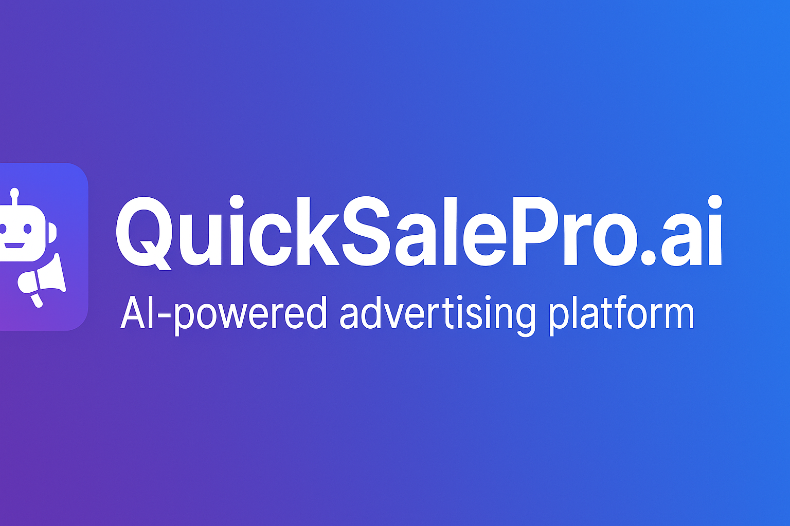

# QuickSalePro.ai
QuickSalePro.ai is an **AI-powered advertising platform**.  
It helps businesses and entrepreneurs generate **high-converting ad creatives** (text + images) and launch campaigns across **Facebook, Instagram, TikTok, and Google Ads**.

---

## 🚀 Features (MVP)
- ✍️ AI-generated ad copy (headlines, descriptions, CTAs).
- 🖼️ AI-generated ad images (1:1 square, 9:16 vertical).
- 📊 Campaign dashboard with KPIs and ROI.
- 💳 Subscription plans (Starter, Pro, Agency).

---

## 🛠️ Tech Stack
- **Frontend:** Next.js + Tailwind CSS  
- **Backend:** Node.js + Express  
- **Database:** PostgreSQL + Prisma  
- **Cloud Hosting:** Vercel (frontend), Railway/Render (backend)  
- **AI Services:** OpenAI (text), DALL·E / Stable Diffusion (images)  

---

## 📌 Project Roadmap
- Phase 0: Setup (domain, GitHub, cloud, environment variables) ✅  
- Phase 1: UX Design (user flows, wireframes)  
- Phase 2: Creative Generator (AI text + images)  
- Phase 3: Meta Ads Integration (read + publish campaigns)  
- Phase 4: Stripe Billing Integration  
- Phase 5: Reporting Dashboard  

---

## 👤 Author
**Peterson Francis**  
Founder of QuickSalePro.ai
